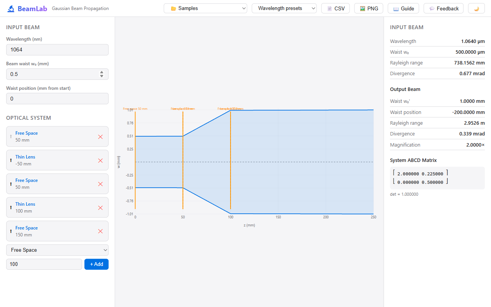

# 🔬 GaussLab

**Interactive Gaussian beam propagation using ABCD ray transfer matrices.**

GaussLab replaces abandoned tools like Paraxia and spreadsheet hacks with a modern web app for designing and analyzing laser optical systems. Define your input beam, build an optical system from lenses, mirrors, and interfaces, and instantly see how the beam propagates.



## Features

- **Define input beam** — wavelength, beam waist w₀, waist position
- **Build optical systems** — free space, thin lens, curved mirror, flat & curved interfaces
- **Real-time propagation** — beam radius w(z) and wavefront radius R(z) plotted interactively
- **Output beam analysis** — new waist size, position, Rayleigh range, divergence, magnification
- **Wavelength presets** — HeNe 633 nm, Nd:YAG 1064 nm / 532 nm
- **Export** — propagation data as CSV, diagram as PNG
- **Light / dark theme**

## Quick Start

```bash
# Prerequisites: Node.js ≥ 18, pnpm
pnpm install
pnpm build          # build engine + web
pnpm --filter @gausslab/web dev   # http://localhost:1451
```

Run the engine tests:

```bash
pnpm --filter @gausslab/engine test
```

## Key Equations

### Rayleigh Range

$$z_R = \frac{\pi\, w_0^2\, n}{\lambda}$$

### Complex Beam Parameter

$$q(z) = z + i\,z_R$$

### ABCD Matrices

| Element | Matrix |
|---|---|
| Free space (length *d*) | $\begin{bmatrix} 1 & d \\ 0 & 1 \end{bmatrix}$ |
| Thin lens (focal length *f*) | $\begin{bmatrix} 1 & 0 \\ -1/f & 1 \end{bmatrix}$ |
| Curved mirror (radius *R*) | $\begin{bmatrix} 1 & 0 \\ -2/R & 1 \end{bmatrix}$ |
| Flat interface (*n₁ → n₂*) | $\begin{bmatrix} 1 & 0 \\ 0 & n_1/n_2 \end{bmatrix}$ |

System matrix: **M = Mₙ × … × M₁** (elements in order of encounter).

### q-Parameter Transform

$$q' = \frac{A\,q + B}{C\,q + D}$$

### Beam Radius from q

$$w^2 = \frac{-\lambda}{\pi\, n\, \text{Im}(1/q)}$$

## Tech Stack

| Layer | Technology |
|---|---|
| Engine | TypeScript, Vitest |
| Web | React 19, Vite 6 |
| Monorepo | pnpm workspaces |

## Project Structure

```
gausslab/
├── packages/
│   ├── engine/          # Pure-TS beam physics library
│   │   └── src/
│   │       ├── beam.ts          # Gaussian beam parameters (zR, w(z), q)
│   │       ├── matrix.ts        # ABCD ray transfer matrices
│   │       ├── propagation.ts   # Beam propagation through optical systems
│   │       └── export.ts        # CSV / summary export
│   └── web/             # React UI
│       └── src/
│           ├── App.tsx           # Main app shell + presets + export
│           ├── BeamInput.tsx     # Beam parameter inputs
│           ├── SystemBuilder.tsx # Optical element list builder
│           ├── BeamDiagram.tsx   # SVG beam propagation plot
│           └── ResultsPanel.tsx  # Output beam parameters display
├── PLAN.md
└── pnpm-workspace.yaml
```

## License

MIT
